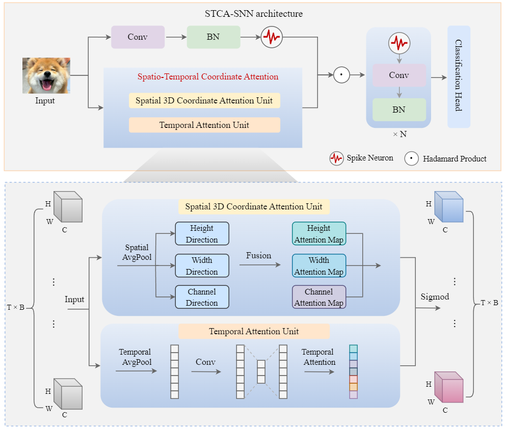
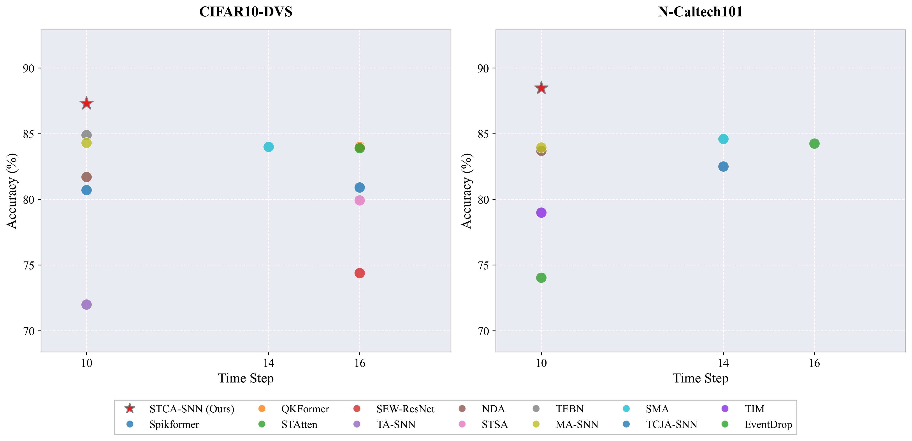

<div align="center" style="font-family: charter;">
<h1>STCA-SNN: Spatio-Temporal Coordinate Attention for Spiking Neural Networks</h1>

<div align="center" style="line-height: 2;">
  <a href="LICENSE" style="margin: 2px;">
    
  </a>
</div>


</div>


## Model Architecture

- This is the official repository for paper *STCA-SNN: Spatio-Temporal Coordinate Attention for Spiking Neural Networks*.

[//]: # (![My Image]&#40;Fig/STCA-SNN.png&#41;)

<div align="center">
  
</div>

## Comparison with the SOTA methods on neuromorphic datasets


<div align="center">
  
</div>

## Prerequisites
- Python 3.9
- Pytorch 2.5.1
- Spikingjelly 0.0.0.0.14

## How to use STCA in the input stage of an SNN

```python
import torch
import torch.nn as nn
from spikingjelly.activation_based import neuron, layer, functional
from module.STCA import Spatio_Temporal_Coordinate_Attention


class SNNInputModule(nn.Module):
    def __init__(self, T=10, in_channels=2, out_channels=64):
        super().__init__()
        self.T = T

        # Using SpikingJelly's built-in layers
        self.conv = layer.Conv2d(in_channels, out_channels, kernel_size=3, padding=1)
        self.bn = layer.BatchNorm2d(out_channels)
        self.lif = neuron.LIFNode(tau=2.0, surrogate_function=neuron.surrogate.Sigmoid())

        # Configure SpikingJelly modules to process temporal sequences natively
        functional.set_step_mode(self, step_mode='m')

        # Initialize STCA
        # Fine-tuning the hyperparameters ratio_1 and ratio_2 may yield better accuracy
        self.stca = Spatio_Temporal_Coordinate_Attention(
            T=self.T,
            out_channels=out_channels,
            ratio_1=8,
            ratio_2=16
        )

    def forward(self, x):
        # Input shape: [Batch, Time, Channels, Height, Width]

        # 1. Convert to SpikingJelly's expected format: [Time, Batch, C, H, W]
        x_t = x.transpose(0, 1)

        # 2. Extract continuous potentials and discrete spikes
        mem_potentials_t = self.bn(self.conv(x_t))
        spikes_t = self.lif(mem_potentials_t)

        # 3. Revert back to STCA format: [Batch, Time, C, H, W]
        mem_potentials = mem_potentials_t.transpose(0, 1)
        spikes = spikes_t.transpose(0, 1)

        # 4. Apply STCA modulation
        modulated_spikes = self.stca(mem_potentials, spikes)

        return modulated_spikes


if __name__ == "__main__":
    # Setup test parameters
    B, T, C, H, W = 4, 10, 2, 48, 48
    device = torch.device("cuda" if torch.cuda.is_available() else "cpu")

    # Initialize the SNN module
    snn_model = SNNInputModule(T=T, in_channels=C, out_channels=64).to(device)
    test_input = torch.randn(B, T, C, H, W).to(device)

    # Forward pass validation
    with torch.no_grad():
        output = snn_model(test_input)

    print(f"SNN STCA Module - Input Shape: {test_input.shape}")
    print(f"SNN STCA Module - Output Shape: {output.shape}")

```
**output**
```
SNN STCA Module - Input Shape: torch.Size([4, 10, 2, 48, 48])
SNN STCA Module - Output Shape: torch.Size([4, 10, 64, 48, 48])
```


## How to use SCAU in CNN

```python
import torch
import torch.nn as nn
from module.SCAU import Three_D_Coordinate_Attention_Unit

class SCAU_CNN_Block(nn.Module):
    def __init__(self, channels):
        super().__init__()
        self.conv = nn.Conv2d(channels, channels, kernel_size=3, padding=1)
        self.bn = nn.BatchNorm2d(channels)
        self.relu = nn.ReLU(inplace=True)
        
        # Initialize SCAU (3D Coordinate Attention)
        self.scau = Three_D_Coordinate_Attention_Unit(
            inp=channels, 
            oup=channels, 
            reduction=16
        )

    def forward(self, x):
        # Initial input shape: [B, C, H, W]
        identity = x
        
        out = self.relu(self.bn(self.conv(x)))
        
        # Step 1: Expand to 5D [B, T, C, H, W] where T=1
        out = out.unsqueeze(1)
        
        # Step 2: Apply Spatial Coordinate Attention
        out = self.scau(out)
        
        # Step 3: Squeeze back to 4D [B, C, H, W]
        out = out.squeeze(1)
        
        return out + identity

if __name__ == "__main__":
    # Setup test parameters
    B, C, H, W = 8, 64, 32, 32
    device = torch.device("cuda" if torch.cuda.is_available() else "cpu")
    
    # Initialize the CNN Block
    cnn_block = SCAU_CNN_Block(channels=C).to(device)
    test_input = torch.randn(B, C, H, W).to(device)
    
    # Forward pass validation
    with torch.no_grad():
        output = cnn_block(test_input)
    
    print(f"CNN SCAU Block - Input Shape: {test_input.shape}")
    print(f"CNN SCAU Block - Output Shape: {output.shape}")
```
**output**
```
CNN SCAU Block - Input Shape: torch.Size([8, 64, 32, 32])
CNN SCAU Block - Output Shape: torch.Size([8, 64, 32, 32])
```


If you have any questions, feel free to send an email to `qingyangswu(at)gmail.com`. I will respond to you as soon as possible.


## Thanks

We gratefully thank the authors for their wonderful works:

- Hou, Qibin, Daquan Zhou, and Jiashi Feng. "Coordinate attention for efficient mobile network design." In Proceedings of the IEEE/CVF conference on computer vision and pattern recognition, pp. 13713-13722. 2021.
- Zhu, Rui-Jie, Malu Zhang, Qihang Zhao, Haoyu Deng, Yule Duan, and Liang-Jian Deng. "TCJA-SNN: Temporal-channel joint attention for spiking neural networks." IEEE Transactions on Neural Networks and Learning Systems 36, no. 3 (2024): 5112-5125.

## Reference

If you find this repo useful, please consider citing:


Yang, Qing, Meiling Zhong, Jiabin Sun, Xiurong Zhong, Shukai Duan, and Lidan Wang. "STCA-SNN: Spatio-temporal coordinate attention for spiking neural networks." Expert Systems with Applications 325 (2026): 132570. https://doi.org/10.1016/j.eswa.2026.132570


```
@article{YANG2026132570,
title = {STCA-SNN: Spatio-Temporal Coordinate Attention for Spiking Neural Networks},
journal = {Expert Systems with Applications},
volume = {325},
pages = {132570},
year = {2026},
issn = {0957-4174},
doi = {https://doi.org/10.1016/j.eswa.2026.132570},
url = {https://www.sciencedirect.com/science/article/pii/S0957417426014831},
author = {Qing Yang and Meiling Zhong and Jiabin Sun and Xiurong Zhong and Shukai Duan and Lidan Wang},
}
```